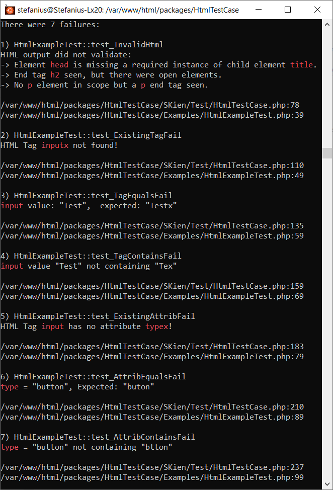

# Extension of PHPUnit Testcase for HTML testing.

 
  
 
 
 
----------
## Overview

Very often the main purpose of a PHP package is to generate any specific HTML code. This 
extension of the existing base class can mainly be used for the automated testing of such 
packages with PHPUnit.

In addition to numerous methods with which the presence or the content of certain tags, 
elements or attributes within an HTML block can be checked, the package also offers the 
possibility of checking an HTML document or block as a whole for its validity. 
*(validates for W3C - HTML5)*

This validation is done with a cURL request to the REST API from 
**[The Nu Html Checker](https://github.com/validator/validator)** that is reachable at 
https://html5.validator.nu.

As a small addition, a text can be checked to ensure that it does not contain any HTML tags

## Available tests
This package contains a class that extends the **PHPUnit** `TestCase` class to perform
HTML test for multiple purposes:

It supports several methods to test/assert for
 - valid HTML5 document/block
 - existing HTML tag/element/attribute
 - HTML tag/element/attribute value equals expected
 - HTML tag/element/attribute contains expected part
 - HTML tag/element has requested style set to expected value
 - given text is plain text (means, text doesn't contain any HTML tags)

[A full class reference can be found here](https://www.phpclasses.org/package/12137-PHP-Extends-PHPUnit-to-test-HTML-output.html#usage).

## Requirements
The class is designed for use with the **Version 9** of **PHPUnit** and to do the cURL
request for HTML validation, the PHP libraries **cURL** and **OpenSSL** are required. 

## Usage
You can integrate the source file **`HtmlTestCase.php`** into your own PHPUnit 
Test-infrastructure (you may have to rename or change the namespace) or use it as it is.

The only change to your own test code is to use the `HtmlTestCase` class instead of 
`TestCase` as the base class for your test cases. The **`phpunit.xml`** is an example 
configuration that calls the tests from the **`ExampleTest`** directory. 

This testcase contains two tests for each assertion-method of the package. The first of each
is passed successful, the second one fails so you can see the generated error messages.

